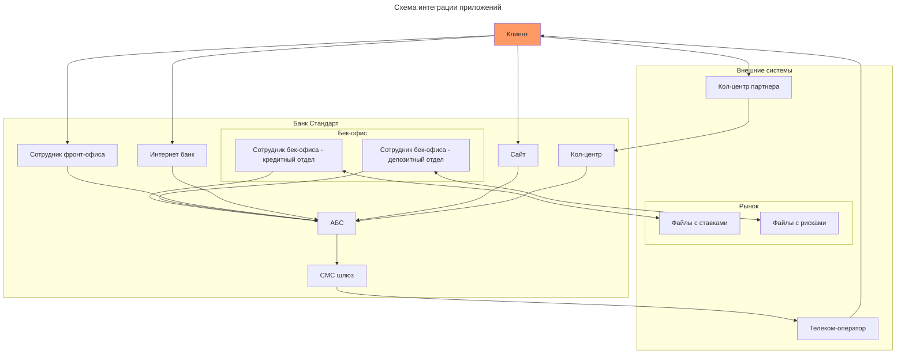

# Схема интеграции приложений

```mermaid
---
title: Схема интеграции приложений
---
flowchart TB
    user[Клиент]:::user

    user --> FS
    user --> IB
    user --> EC
    user --> S

    TELECOM --> user

    subgraph Внешние системы
        TELECOM[Телеком-оператор]
        EC[Кол-центр партнера]

        subgraph Рынок
            K[Файлы с ставками]
            D[Файлы с рисками]
        end
    end

    subgraph Банк Стандарт
        FS[Сотрудник фронт-офиса]
        IB[Интернет банк]
        IC[Кол-центр]
        ABC[АБС]
        SMS[СМС шлюз]
        S[Сайт]

        BSC --> ABC
        BSD --> ABC

        FS --> ABC
        IB --> ABC
        S --> ABC
        IC --> ABC

        ABC --> SMS
        SMS --> TELECOM

        EC --> IC


        subgraph Бек-офис
            BSC[Сотрудник бек-офиса - кредитный отдел]
            BSD[Сотрудник бек-офиса - депозитный отдел]

            BSC <--> K
            BSD <--> D
        end
    end

    classDef user fill:#f96
```
