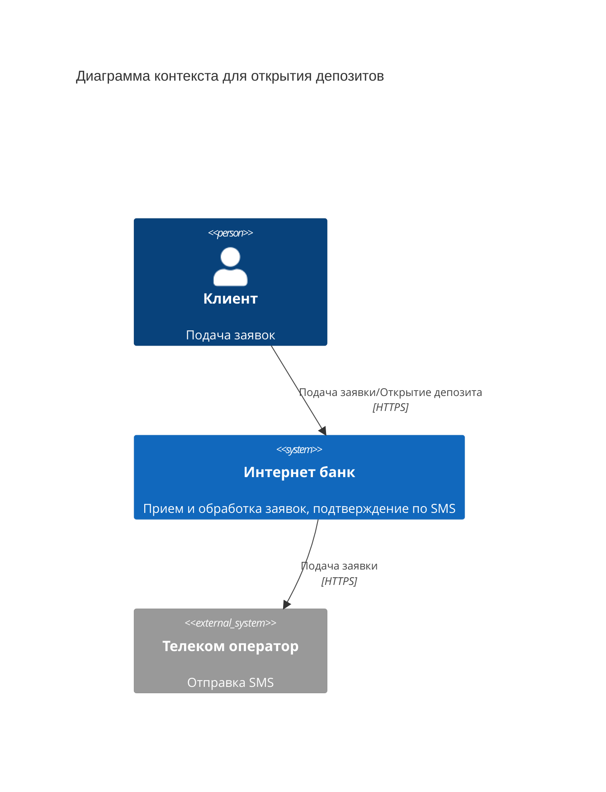
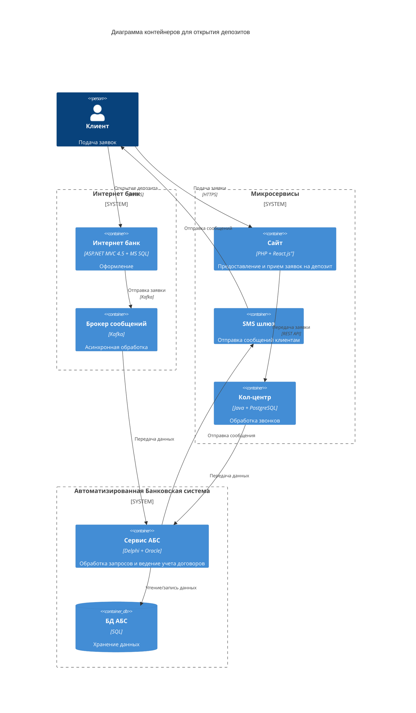

### **Название задачи:**

Концептуальная архитектура MVP для цифрового открытия депозитов

### **Автор:**

Разработчик IT отдела

### **Дата:**

11.05.2025

### **Функциональные требования**

| **№** | **Действующие лица или системы** | **Use Case**                        | **Описание**                                                                                      |
| :---: | :------------------------------- | :---------------------------------- | :------------------------------------------------------------------------------------------------ |
|   1   | Клиент                           | Подача заявки через интернет-банк   | Клиент выбирает свой счёт и сумму, далее подтверждает операцию через СМС и создаётся заявка в АБС |
|   2   | Клиент                           | Подача заявки на депозит через сайт | Клиент оставляет свои данные, далее заявка передаётся в кол-центр                                 |
|   3   | Клиент                           | Просмотр списка депозитов           | Клиент просматривает актуальные депозиты                                                          |
|   4   | Бэк-офис                         | Подтверждение заявки в АБС          | Сотрудник бэк-офиса проверяет и подтверждает заявку, отправляя СМС клиенту.                       |
|   5   | Кол-центр                        | Обработка заявки с сайта            | Менеджер кол-центра связывается с клиентом для уточнения условий                                  |
|   6   | АБС                              | Расчёт ставок                       | Автоматический расчёт ставок на основе данных из АБС                                              |

### **Нефункциональные требования**

| **№** | **Требование**                                                          |
| :---: | :---------------------------------------------------------------------- |
|   1   | Горизонтальное масштабирование системы                                  |
|   2   | Шифрование данных                                                       |
|   3   | Время отклика интерфейсов < 500 мс                                      |
|   4   | Асинхронная обработка заявок через очереди событий (Kafka или RabbitMQ) |
|   5   | Доступность сервисов на 99.9% для критически важных систем (АБС)        |

### **Решение**

#### Диаграмма контекста для открытия депозитов

#### Диаграмма контейнеров для открытия депозитов

### **Альтернативы**

- Прямая интеграция интернет-банка с АБС через API
- Хранение ставок в отдельной SQL-БД

**Недостатки, ограничения, риски**

- Монолитная АБС - сложность внедрения новых функций
- Ручная обработка заявок бэк-офисом сохранена в MVP
- Legacy АБС (Delphi) - устаревшая кодовая база, высокая стоимость поддержки
