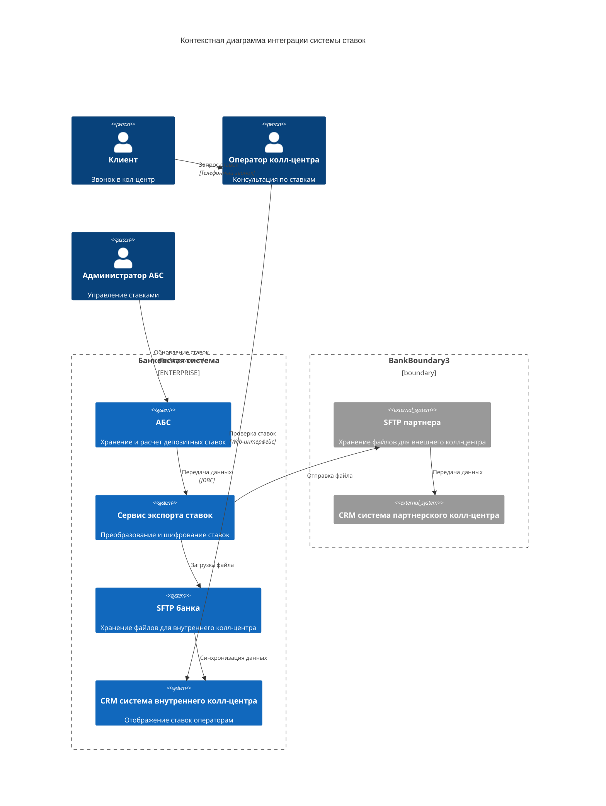
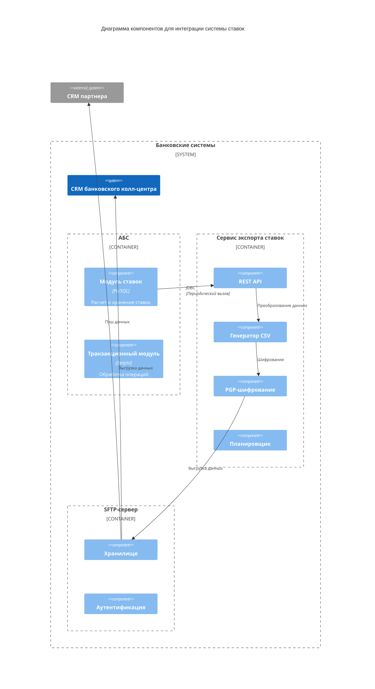

### **Название задачи:**

Передача ставок в кол-центр
### **Автор:**

Разработчик IT отдела
### **Дата:**

25.05.2025
### **Функциональные требования**

| №   | Действующие лица или системы | Use Case               | Описание                                                                                    |
| --- | ---------------------------- | ---------------------- | ------------------------------------------------------------------------------------------- |
| 1   | Основной кол-центр           | Получение ставок       | Система кол-центра должна получать актуальные ставки по депозитам из системы ставок         |
| 2   | Партнёрский кол-центр        | Экспорт ставок         | Система ставок должна формировать файлы со ставками и передавать их в партнёрский кол-центр |
| 3   | Оператор кол-центра          | Просмотр ставок        | Операторы должны иметь доступ к актуальным ставкам в интерфейсе системы                     |
| 4   | Система мониторинга          | Отслеживание изменений | Система должна отслеживать успешность синхронизации ставок                                  |
### **Решение**

#### Диаграмма контекста

####  Диаграмма компонентов

### **Альтернативы**

- Полная интеграция через API для обоих кол-центров (отклонена из-за технических ограничений партнёрского кол-центра) 
- Использование промежуточного сервиса ETL (отклонена из-за дополнительных затрат)
- Ручная загрузка данных (отклонена из-за высоких рисков ошибок)
### **Недостатки, ограничения, риски**

- Зависимость от надёжности канала передачи файлов для партнёрского кол-центра
- Возможные задержки в обновлении данных из-за файловой синхронизации
- Необходимость дополнительной валидации данных при экспорте
- Сложность поддержки двух разных механизмов синхронизации
### **Список задач для реализации**

**Система ставок:**

- Разработка API для основного кол-центра
- Реализация модуля экспорта файлов
- Создание системы мониторинга синхронизации
- Внедрение механизма шифрования данных
- Разработка системы логгирования

**Основной кол-центр:**

- Интеграция с новым API
- Разработка интерфейса отображения ставок
- Настройка автоматического обновления данных

**Партнёрский кол-центр:**

- Настройка процесса приёма файлов
- Разработка механизма обновления данных
- Интеграция со своей CRM-системой

**Команда поддержки:**

- Разработка документации по интеграции
- Подготовка инструкций для операторов
- Организация тестирования
- Обеспечение технической поддержки
